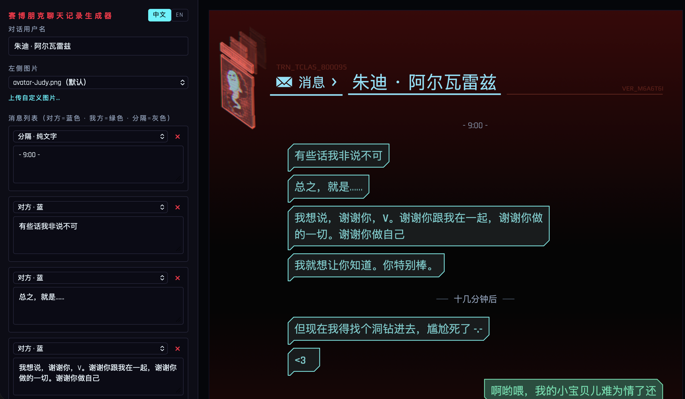
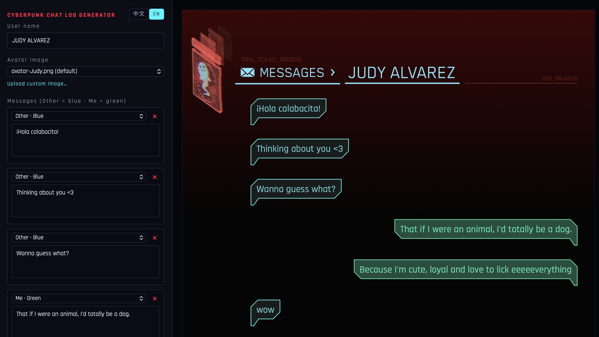
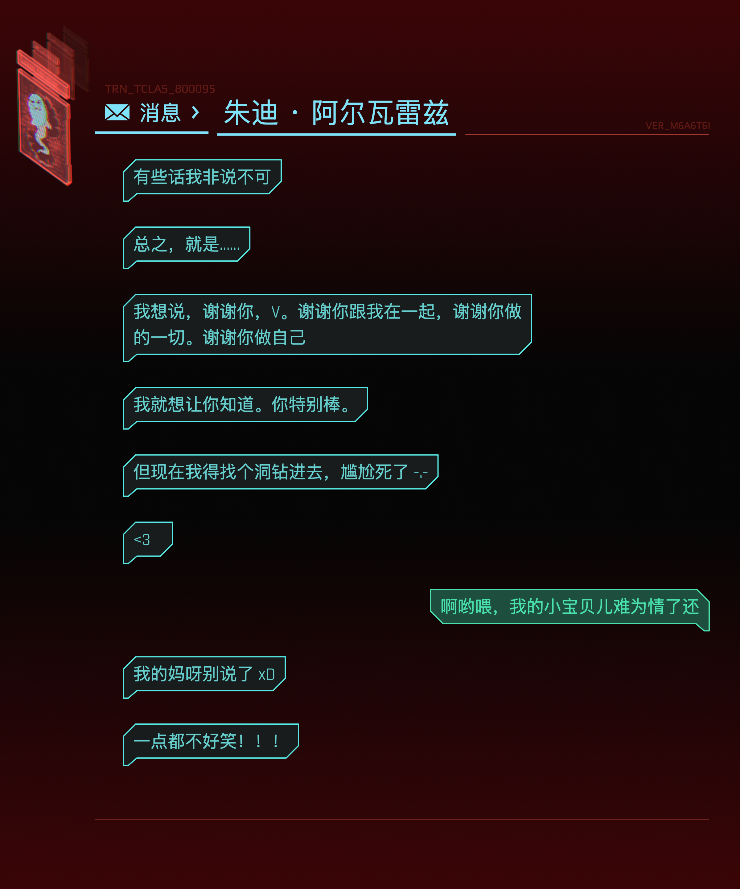
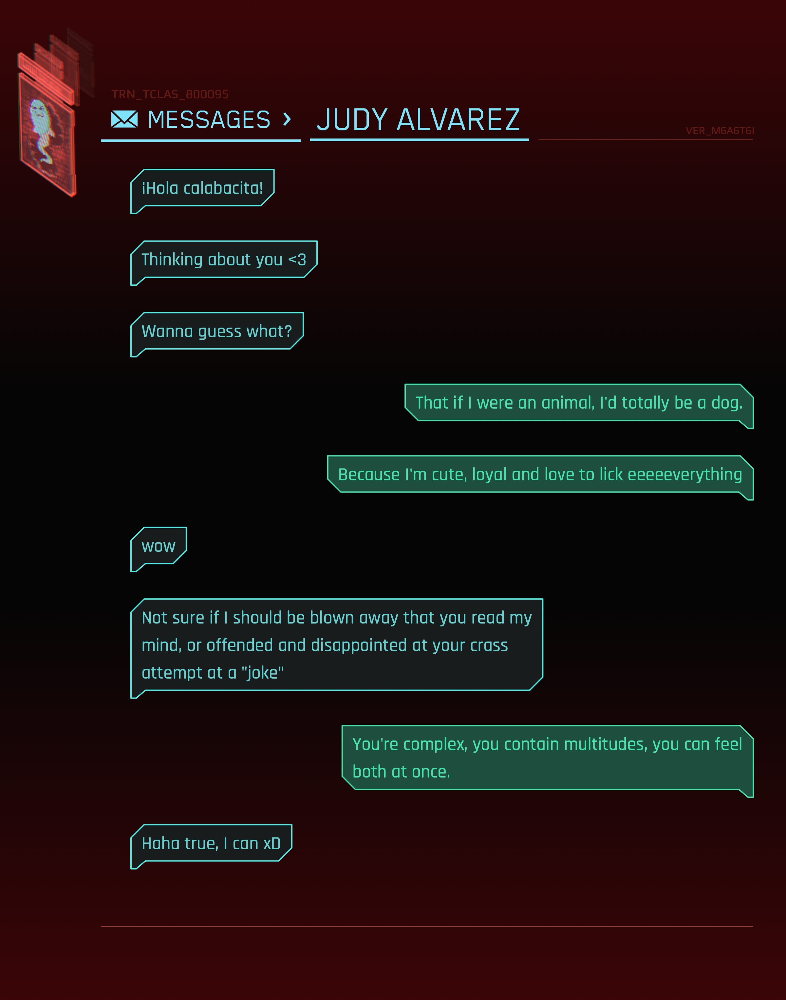

# 赛博朋克聊天记录生成器 / Cyberpunk Chat Log Generator

一个纯前端、单文件的小工具：生成高度还原《赛博朋克 2077》当前版本短信界面风格的聊天记录图片，支持中英双语切换，导出高清 PNG。

A pure front-end, single-file web tool that generates chat-log images faithfully styled after the current in-game SMS interface of *Cyberpunk 2077*. It supports Chinese/English switching and exports high-resolution PNG images.

**在线试用 / Live Demo**: https://daming98.github.io/cyberpunk-message-generator/

## 预览 / Preview

以下为中文 / 英文两种语言下的界面与导出效果（左：中文，右：英文）。

Below are the UI and exported results in Chinese / English (left: Chinese, right: English).

  
  

  
  

## 合作说明 / Credits

本项目由两位创作者共同完成：

- **设计资源与默认头像**：微博：hijimmmy / LOFTER：Hijimmy —— 提供了整体设计资源、页面布局方案、颜色以及默认头像图片 `avatar-Judy.png`、`avatar-Panam.png`。这位太太持续在《赛博朋克 2077》同人圈产出作品，感谢！
- **代码实现**：本人@daming98

This project is a joint effort by two creators:

- **Design assets & default avatars**: Weibo: hijimmmy / LOFTER: Hijimmy — provided the overall design assets, page layout, colors, and the default avatar images `avatar-Judy.png` and `avatar-Panam.png`. She keeps creating works in the *Cyberpunk 2077* fan community. Thank you!
- **Code implementation**: myself

## 主要特点 / Features

- **高度还原游戏短信界面**：配色、信封图标、斜角气泡与小尾巴、暗红细字、下划线、渐变背景等细节，均按《赛博朋克 2077》现行短信界面的风格制作
- **中英双语**：界面文案、画布页头（消息 / MESSAGES）、字体与默认聊天记录都会跟随语言切换
  - 中文：微软雅黑 / 苹方（页头与用户名）
  - 英文：Blender Pro（页头与用户名，缺失时回退 Rajdhani）
  - 暗红细字：Play
  - 消息体西文：Rajdhani
- **大量可配置字段**：脚本顶部 `CONFIG` / `PALETTE` 涵盖尺寸、间距、字号、字重、边距与颜色；中英文的字号、字重均可独立配置
- **单文件、零依赖**：无需安装、无需构建，浏览器打开即用；导出支持 1x / 2x / 3x 倍率
- **头像**：内置默认头像可选，也支持上传自定义图片
- **兼容性**：已在 macOS 与 Windows 的 Chrome 上测试通过

- **Faithful reproduction of the in-game SMS UI**: colors, envelope icon, beveled bubbles with tails, dark-red small text, underlines, gradient background and other details all follow the current *Cyberpunk 2077* in-game messaging style
- **Bilingual (Chinese / English)**: UI text, canvas header (消息 / MESSAGES), fonts and default chat messages all switch with the selected language
  - Chinese: Microsoft YaHei / PingFang (header and username)
  - English: Blender Pro (header and username; falls back to Rajdhani if missing)
  - Dark-red small text: Play
  - Western letters in message bubbles: Rajdhani (weight 500 by default in English)
- **Extensive configurable fields**: `CONFIG` / `PALETTE` at the top of the script cover sizes, spacing, font sizes, weights, margins and colors; font sizes and weights can be configured independently for Chinese and English
- **Single file, zero dependencies**: no installation or build needed — just open it in a browser; export supports 1x / 2x / 3x scale
- **Avatars**: choose from the bundled default avatars, or upload your own image
- **Compatibility**: tested on Chrome for macOS and Windows

## 使用方法 / Usage

1. 下载或克隆本仓库
2. 用浏览器打开 `cyber-message.html`：
   - 直接双击即可使用；
   - 更推荐用本地服务器打开（头像与导出不受浏览器本地安全限制）：在本目录运行 `python -m http.server`（macOS 可能需要 `python3 -m http.server`），然后访问 `http://localhost:8000/cyber-message.html`
3. 在左侧面板填写用户名、选择头像、编辑消息列表（对方 = 蓝，我方 = 绿）
4. 选择导出倍率，点击「导出 PNG」

> 直接双击（file://）打开时，导出含本地头像的 PNG 可能被浏览器安全策略拦截，按页面弹窗提示操作一次即可自动完成导出；或改用本地服务器方式。

1. Download or clone this repository
2. Open `cyber-message.html` in a browser:
   - double-click it to start directly;
   - opening via a local server is recommended (avatars and export are not affected by browser local-security restrictions): run `python -m http.server` in this directory (on macOS you may need `python3 -m http.server`), then visit `http://localhost:8000/cyber-message.html`
3. In the left panel, fill in the username, choose an avatar, and edit the message list (Other = blue, Me = green)
4. Pick an export scale and click「导出 PNG」/「Export PNG」

> When opened by double-click (file://), exporting a PNG that includes a local avatar may be blocked by browser security policies. Follow the on-page dialog once and the export will complete automatically; or use a local server instead.

## 自定义配置 / Configuration

所有可调参数都集中在 `cyber-message.html` 内 `<script>` 顶部的 `CONFIG` 与 `PALETTE`，注释齐全，主要包括：

| 位置 | 可配置内容 |
| --- | --- |
| 画布 | 逻辑宽度、底部留白 |
| 头像 | 显示宽度 `avatarW`、左边距 `avatarMarginX`、顶边距 `avatarMarginY` |
| 页头 | 标题/用户名中文字号与英文字号（`hdrTitleSizeEn` / `hdrUserNameSizeEn`）、字重、信封图标、箭头、下划线、暗红细字 `hdrCode` / `hdrVer` |
| 气泡 | 字号 `msgFontSize`、英文消息字重 `msgWeightEn`、行高、内边距、最大宽度、斜角 `bevel`、尾巴 `tailFront` / `tailSlope` / `tailDrop`、气泡间隔 |
| 配色 | `PALETTE` 中的全部颜色 |
| 默认消息 | `DEFAULT_MESSAGES`（中文、英文两套，可自行替换为任意内容） |
| 字体 | `fontFamily`、`fontHeaderZh`、`fontHeaderEn`、`fontMeta` |

All adjustable parameters are centralized in `CONFIG` and `PALETTE` at the top of the `<script>` section in `cyber-message.html`, with detailed comments. Main areas:

| Area | What can be configured |
| --- | --- |
| Canvas | Logical width, bottom padding |
| Avatar | Display width `avatarW`, left margin `avatarMarginX`, top margin `avatarMarginY` |
| Header | Chinese and English font sizes for the title / username (`hdrTitleSizeEn` / `hdrUserNameSizeEn`), font weight, envelope icon, arrow, underline, dark-red small text `hdrCode` / `hdrVer` |
| Bubbles | Font size `msgFontSize`, English message weight `msgWeightEn`, line height, padding, max width, bevel `bevel`, tail `tailFront` / `tailSlope` / `tailDrop`, bubble spacing |
| Colors | All colors in `PALETTE` |
| Default messages | `DEFAULT_MESSAGES` (separate Chinese and English sets, freely replaceable with any content) |
| Fonts | `fontFamily`, `fontHeaderZh`, `fontHeaderEn`, `fontMeta` |

## 布局与兼容性 / Layout & Compatibility

页面（画布）除头像为位图外，其余元素全部为矢量绘制（文字、路径、矩形、描边，效果同 SVG）：不依赖图片资源、缩放清晰，只要浏览器支持 Canvas 2D 即可正常显示。整个布局由**两个基准点**出发、其余元素全部逐级派生，没有其他写死的绝对坐标：

- **Y 基准点**：顶部细红字（`hdrCode`，TRN_TCLAS_800095）的基线 `CONFIG.hdrCodeY` —— 唯一的绝对 Y 锚点。信封图标、标题、用户名、暗红细字（VER）、两条下划线、消息区起点、气泡排布与画布总高（随内容自适应）全部由它派生。
- **X 基准点**：左边距 `CONFIG.marginLeft`（画布左缘 →「消息」下划线左端）。信封图标 x = `marginLeft + hdrLinePadX`，消息区 x = 图标 x + `msgIndent`；右侧元素（VER、暗红延伸线、我方气泡、底部红线）统一以 `width - marginRight` 为右边界。

元素之间通过「相对间距」参数连接（`hdrCodeToIconGapY`、`hdrIconGap`、`hdrUserNameGap`、`msgStartGap`、`gapBetween` 等），文字基线由运行时 `measureText` 实测字形反推，因此更换字体、字号或系统时布局会自动适配。**如需为特定环境做调整：优先修改基准点或元素间的间距参数，不要写死新的绝对坐标**——所有参数都集中在脚本顶部的 `CONFIG`（尺寸/间距/字号）与 `PALETTE`（颜色）中。

Everything on this page (the canvas) is drawn as vector elements — text, paths, rectangles and strokes, SVG-like — except for the avatar, which is a bitmap image. It needs no image assets, stays crisp at any scale, and works as long as the browser supports Canvas 2D. The whole layout is computed from **two anchor points**, with every other element derived step by step — there are no other hard-coded absolute coordinates:

- **Y anchor**: the baseline of the top thin red text (`hdrCode`, TRN_TCLAS_800095) at `CONFIG.hdrCodeY` — the only absolute Y anchor. The envelope icon, title, username, dark-red VER text, both underlines, the start of the message area, bubble placement and the total canvas height (which grows with the content) are all derived from it.
- **X anchor**: the left margin `CONFIG.marginLeft` (canvas left edge → the left end of the "消息" underline). Envelope icon x = `marginLeft + hdrLinePadX`, message area x = icon x + `msgIndent`; elements on the right (VER, the dark-red extension line, "me" bubbles, the bottom line) all share the right boundary `width - marginRight`.

Elements are connected through relative spacing parameters (e.g. `hdrCodeToIconGapY`, `hdrIconGap`, `hdrUserNameGap`, `msgStartGap`, `gapBetween`), and text baselines are derived from glyph metrics measured at runtime via `measureText`, so the layout adapts automatically when fonts, font sizes or systems differ. **To adjust for a specific environment: change the anchors or the spacing parameters first — avoid hard-coding new absolute coordinates.** All parameters live in `CONFIG` (sizes / spacing / font sizes) and `PALETTE` (colors) at the top of the script.

## 字体说明 / Fonts

- **Rajdhani / Play**：通过 Google Fonts 在线加载，需要联网；离线或加载失败时自动回退系统字体
- **Blender Pro**：商用字体，随仓库提供（仅限本非商业粉丝项目使用，商业用途需自行获取授权）

- **Rajdhani / Play**: loaded online from Google Fonts — an internet connection is required; falls back to system fonts when offline or if loading fails
- **Blender Pro**: a commercial font, bundled with the repository for non-commercial fan use only (commercial use requires obtaining a license)

## 已知限制 / Known Limitations

- 消息内容仅支持纯文字，暂不支持发送图片 / 表情包
- 离线或 Google Fonts 不可用时，字体回退为系统字体，观感会与预期效果有差异，可以通过引用字体文件解决
- 除 macOS / Windows 的 Chrome 外，其他浏览器与系统未做系统测试（欢迎反馈问题）

- Message content is text-only; images / stickers as messages are not supported yet
- When offline or when Google Fonts is unavailable, fonts fall back to system fonts and the look may differ from the intended design; this can be solved by referencing local font files
- Apart from Chrome on macOS / Windows, other browsers and systems have not been systematically tested (feedback is welcome)

## 开源协议 / License

本项目基于 **MIT License** 开源。

This project is open-sourced under the **MIT License**.

## 版权与免责声明 / Copyright & Disclaimer

本项目为粉丝自制的**非商业**作品。由于本项目包含商用字体《Blender Pro》以及《赛博朋克 2077》相关的设计元素（游戏及其素材的版权归 CD Projekt Red 所有，字体版权归其权利人所有），**禁止任何形式的商业使用**；如需商业用途，请先向相关权利方获取授权。MIT 开源协议仅适用于本项目的代码部分，不构成对上述字体与游戏素材的授权。

This project is a **non-commercial** fan-made work. As it includes the commercial font "Blender Pro" and design elements related to *Cyberpunk 2077* (the game and its assets are copyright of CD Projekt Red; the font is copyright of its respective rights holders), **any commercial use is prohibited**. For commercial use, please obtain proper licenses from the rights holders first. The MIT License applies only to the source code of this project and does not grant any rights to the aforementioned font or game assets.
