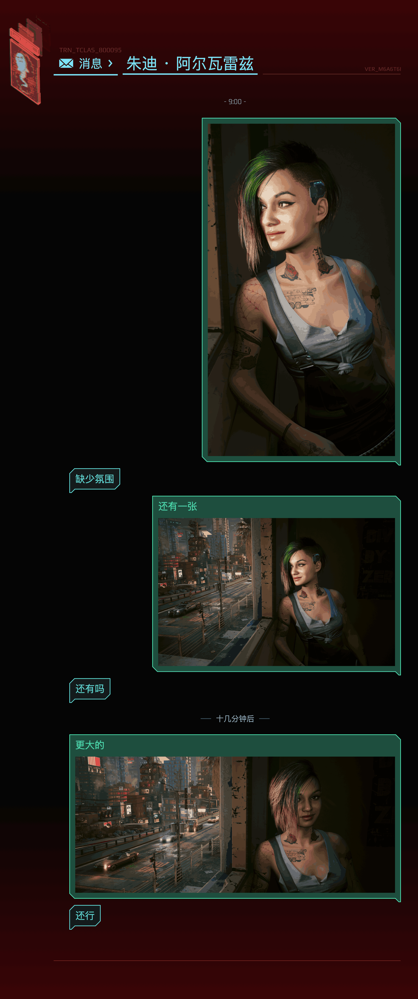

# 赛博朋克聊天记录生成器 / Cyberpunk Chat Log Generator

一个纯前端、单文件的小工具：生成高度还原《赛博朋克 2077》当前版本短信界面风格的聊天记录图片，支持中英双语切换，导出高清 PNG。

A pure front-end, single-file web tool that generates chat-log images faithfully styled after the current in-game SMS interface of *Cyberpunk 2077*. It supports Chinese/English switching and exports high-resolution PNG images.

**在线试用 / Live Demo**: https://daming98.github.io/cyberpunk-message-generator/

## 预览 / Preview

以下为中文 / 英文两种语言下的界面与导出效果（左：中文，右：英文）。

Below are the UI and exported results in Chinese / English (left: Chinese, right: English).

  
  

  
  

  

消息内可附带图片，宽度分大 / 中 / 小三档（等比缩放到所选档位宽度、不拉伸，高度随原图比例）：

Images can be attached to any message in three width tiers (large / medium / small); scaled proportionally to the selected tier width and never stretched — height follows the source aspect ratio.

## 合作说明 / Credits

本项目由两位创作者共同完成：

- **设计资源与默认头像**：微博：hijimmmy / LOFTER：Hijimmy —— 提供了整体设计资源、页面布局方案、颜色以及默认头像图片 `avatar-Judy.png`、`avatar-Panam.png`。这位太太持续在《赛博朋克 2077》同人圈产出作品，感谢！
- **代码实现**：本人@daming98

This project is a joint effort by two creators:

- **Design assets & default avatars**: Weibo: hijimmmy / LOFTER: Hijimmy — provided the overall design assets, page layout, colors, and the default avatar images `avatar-Judy.png` and `avatar-Panam.png`. She keeps creating works in the *Cyberpunk 2077* fan community. Thank you!
- **Code implementation**: myself

## 主要特点 / Features

- **高度还原游戏短信界面**：配色、信封图标、斜角气泡与小尾巴、暗红细字、下划线、渐变背景等细节，均按《赛博朋克 2077》现行短信界面的风格制作
- **中英双语**：界面文案、画布页头（消息 / MESSAGES）、字体与默认聊天记录都会跟随语言切换
  - 中文：苹方（优先）→ 思源黑体 / Noto Sans SC（Google Fonts 在线加载）→ 微软雅黑（兜底）
  - 英文：Blender Pro（页头，缺失时回退 Rajdhani）、Rajdhani（用户名，字符支持更全，英文模式自动转大写）
  - 暗红细字：Play
  - 消息体西文：Rajdhani（西文字重可配 `msgWeight`，中文保持常规）
- **大量可配置字段**：脚本顶部 `CONFIG` / `PALETTE` 涵盖尺寸、间距、字号、字重、边距与颜色；中英文的字号、字重均可独立配置
- **单文件、零依赖**：无需安装、无需构建，浏览器打开即用；导出支持 1x / 2x / 3x 倍率，手机端可点「保存到相册」并长按图片存入系统相册；除整张导出外，另有「单条气泡 ZIP」——把每条对话气泡单独导出为透明底 PNG 并打包成 zip（每条消息行内也可「导出这条」）
- **头像**：内置默认头像可选，也支持上传自定义图片
- **消息类型**：对方（蓝）/ 我方（绿）/ 分隔（带分割线、纯文字）——分隔用于「19:00」「十分钟后」这类时间 / 间隔提示，字体、字号、字重、线与文字间距、线长等均可配（见 CONFIG.divider*）；分隔块间距可逐条选择窄 / 中 / 宽三档
- **消息图片**：任意消息可附带一张图片，宽度分大 / 中 / 小三档（大 = 内容区宽度、中 = 气泡最大宽度、小 = 气泡最大宽度 × 80%）；图片等比缩放到所选档位宽度（小图放大、不拉伸），高度随原图比例（高度上限 1200px）
- **兼容性**：已在 macOS 与 Windows 的 Chrome 上测试通过

- **Faithful reproduction of the in-game SMS UI**: colors, envelope icon, beveled bubbles with tails, dark-red small text, underlines, gradient background and other details all follow the current *Cyberpunk 2077* in-game messaging style
- **Bilingual (Chinese / English)**: UI text, canvas header (消息 / MESSAGES), fonts and default chat messages all switch with the selected language
  - Chinese: PingFang (preferred) → Noto Sans SC / Source Han Sans (loaded from Google Fonts) → Microsoft YaHei (fallback)
  - English: Blender Pro (header; falls back to Rajdhani if missing); Rajdhani (user name, broader character coverage, auto-uppercase in English mode)
  - Dark-red small text: Play
  - Western letters in message bubbles: Rajdhani (weight configurable via `msgWeight`; CJK text stays regular)
- **Extensive configurable fields**: `CONFIG` / `PALETTE` at the top of the script cover sizes, spacing, font sizes, weights, margins and colors; font sizes and weights can be configured independently for Chinese and English
- **Single file, zero dependencies**: no installation or build needed — just open it in a browser; export supports 1x / 2x / 3x scale, and on mobile "Save to Photos" + press-and-hold stores the image straight to the photo library; besides the full-image export, "Bubbles ZIP" exports every message bubble as a transparent PNG packed into a ZIP (each message row also offers "Export this")
- **Avatars**: choose from the bundled default avatars, or upload your own image
- **Message types**: Other (blue) / Me (green) / Divider (with lines, or text-only) — dividers are for "19:00" / "ten minutes later" style separators; font, size, weight, line-to-text gap, line length etc. are all configurable (see CONFIG.divider*); divider spacing is selectable per divider (narrow / medium / wide)
- **Message images**: attach an image to any message — three width tiers (Large = content width, Medium = max bubble width, Small = max bubble width × 80%); images scale proportionally to the selected tier width (small images enlarged, never stretched); height follows the source aspect ratio (max height 1200px)
- **Compatibility**: tested on Chrome for macOS and Windows

## 内置头像 / Built-in Avatars

目前内置 15 个角色头像（均为同目录 `avatar-*.png` 文件，替换同名文件即可换图；也可上传自定义图片）：

- 朱迪 · 阿尔瓦雷兹（Judy）— `avatar-Judy.png`（默认）
- 帕南（Panam）— `avatar-Panam.png`
- 克莱尔（Claire）— `avatar-Claire.png`
- 德拉曼（Delamain）— `avatar-Delamain.png`
- 艾芙琳 · 帕克（Evelyn）— `avatar-Evelyn.png`
- 杰克 · 威尔斯（Jackie）— `avatar-Jackie.png`
- 克里（Kerry）— `avatar-Kerry.png`
- 米契（Mitch）— `avatar-Mitch.png`
- 瑞吉娜（Regina）— `avatar-Regina.png`
- 瑞弗（River）— `avatar-River.png`
- 索尔 · 布赖特（Saul）— `avatar-Saul.png`
- 竹村（Take）— `avatar-Take.png`
- 未知角色（Unknown）— `avatar-Unknown.png`
- 维克多 · 维克托（Victor）— `avatar-Victor.png`
- 威尔斯妈妈（WellesMama）— `avatar-WellesMama.png`

The repository bundles 15 character avatars (all are `avatar-*.png` files in the same folder — replace a file to change it, or upload your own image):

- Judy Alvarez — `avatar-Judy.png` (default)
- Panam Palmer — `avatar-Panam.png`
- Claire Russell — `avatar-Claire.png`
- Delamain — `avatar-Delamain.png`
- Evelyn Parker — `avatar-Evelyn.png`
- Jackie Welles — `avatar-Jackie.png`
- Kerry Eurodyne — `avatar-Kerry.png`
- Mitch Anderson — `avatar-Mitch.png`
- Regina Jones — `avatar-Regina.png`
- River Ward — `avatar-River.png`
- Saul Bright — `avatar-Saul.png`
- Goro Takemura (Take) — `avatar-Take.png`
- Unknown — `avatar-Unknown.png`
- Viktor Vektor — `avatar-Victor.png`
- Mama Welles — `avatar-WellesMama.png`

## 使用方法 / Usage

1. 下载或克隆本仓库
2. 用浏览器打开 `cyber-message.html`：
   - 直接双击即可使用；
   - 更推荐用本地服务器打开（头像与导出不受浏览器本地安全限制）：在本目录运行 `python -m http.server`（macOS 可能需要 `python3 -m http.server`），然后访问 `http://localhost:8000/cyber-message.html`
3. 在左侧面板填写用户名、选择头像、编辑消息列表（对方 = 蓝，我方 = 绿）
4. 选择导出倍率，点击「导出 PNG」（或点「单条气泡 ZIP」导出气泡包；每条消息行内也有「导出这条」）
5. 手机端：点「保存到相册」，长按图片选择「存储到照片」存入系统相册；发微信时请在微信聊天里用「+ → 相册」选择该图并勾选「原图」发送

> 直接双击（file://）打开时，导出含本地头像的 PNG 可能被浏览器安全策略拦截，按页面弹窗提示操作一次即可自动完成导出；或改用本地服务器方式。

> **发微信的正确姿势**：不要直接分享给微信——即使先「导出到文件」、再从文件 App 分享到微信，图片同样会被微信压缩（转 JPG、缩小尺寸、颜色失真）。请先存入相册，再从微信里以「原图」发送。

1. Download or clone this repository
2. Open `cyber-message.html` in a browser:
   - double-click it to start directly;
   - opening via a local server is recommended (avatars and export are not affected by browser local-security restrictions): run `python -m http.server` in this directory (on macOS you may need `python3 -m http.server`), then visit `http://localhost:8000/cyber-message.html`
3. In the left panel, fill in the username, choose an avatar, and edit the message list (Other = blue, Me = green)
4. Pick an export scale and click「导出 PNG」/「Export PNG」 (or click "Bubbles ZIP" for a per-bubble transparent PNG pack; each message row also offers "Export this")
5. On mobile: tap "Save to Photos" and long-press the image to save it to your photo library; when sending it on WeChat, pick the image via "+ → Albums" inside the chat and tick "Original"

> When opened by double-click (file://), exporting a PNG that includes a local avatar may be blocked by browser security policies. Follow the on-page dialog once and the export will complete automatically; or use a local server instead.

> **Sending to WeChat the right way**: do not share the image directly to WeChat — even if you export it to Files first and share from the Files app, WeChat still recompresses it (JPG, downscaled, colors shifted). Always save it to the photo library first, then send it from WeChat with "Original" ticked.

## 自定义配置 / Configuration

所有可调参数都集中在 `cyber-message.html` 内 `<script>` 顶部的 `CONFIG` 与 `PALETTE`，注释齐全，主要包括：

| 位置 | 可配置内容 |
| --- | --- |
| 画布 | 逻辑宽度、底部留白 |
| 头像 | 显示宽度 `avatarW`、左边距 `avatarMarginX`、顶边距 `avatarMarginY` |
| 页头 | 标题/用户名中文字号与英文字号（`hdrTitleSizeEn` / `hdrUserNameSizeEn`）、字重、信封图标、箭头、下划线、暗红细字 `hdrCode` / `hdrVer` |
| 气泡 | 字号 `msgFontSize`、西文字重 `msgWeight`（中文保持常规）、英文垂直拉长 `msgStretchEn`、行高、内边距、最大宽度、斜角 `bevel`、尾巴 `tailFront` / `tailSlope` / `tailDrop`、气泡间隔 |
| 消息图片 | 小档宽度比例 `msgImgSmallRatio`、高度上限 `msgImgMaxH`（0 = 不限）、图文间距 `msgImgGapY` |
| 分隔 | 字体 `dividerFont`、字号 `dividerFontSize`、字重 `dividerWeight`、线与文字间距 `dividerLineGapX`、线长 `dividerLineLen`（0=不画线）、线粗 `dividerLineW`、上下留白 `dividerPadY`（默认值；逐条可选：窄 25 / 中 50 / 宽 80） |
| 配色 | `PALETTE` 中的全部颜色 |
| 默认消息 | `DEFAULT_MESSAGES`（中文、英文两套，可自行替换为任意内容） |
| 字体 | `fontFamily`、`fontHeaderZh`、`fontHeaderEn`、`fontUserNameEn`、`fontMeta` |

All adjustable parameters are centralized in `CONFIG` and `PALETTE` at the top of the `<script>` section in `cyber-message.html`, with detailed comments. Main areas:

| Area | What can be configured |
| --- | --- |
| Canvas | Logical width, bottom padding |
| Avatar | Display width `avatarW`, left margin `avatarMarginX`, top margin `avatarMarginY` |
| Header | Chinese and English font sizes for the title / username (`hdrTitleSizeEn` / `hdrUserNameSizeEn`), font weight, envelope icon, arrow, underline, dark-red small text `hdrCode` / `hdrVer` |
| Bubbles | Font size `msgFontSize`, Western-text weight `msgWeight` (CJK stays regular), English vertical stretch `msgStretchEn`, line height, padding, max width, bevel `bevel`, tail `tailFront` / `tailSlope` / `tailDrop`, bubble spacing |
| Message images | Small-tier width ratio `msgImgSmallRatio`, max height `msgImgMaxH` (0 = unlimited), image-to-text gap `msgImgGapY` |
| Divider | Font `dividerFont`, size `dividerFontSize`, weight `dividerWeight`, line-to-text gap `dividerLineGapX`, line length `dividerLineLen` (0 = no lines), line width `dividerLineW`, vertical padding `dividerPadY` (default; per-divider selectable: narrow 25 / medium 50 / wide 80) |
| Colors | All colors in `PALETTE` |
| Default messages | `DEFAULT_MESSAGES` (separate Chinese and English sets, freely replaceable with any content) |
| Fonts | `fontFamily`, `fontHeaderZh`, `fontHeaderEn`, `fontUserNameEn`, `fontMeta` |

## 布局与兼容性 / Layout & Compatibility

页面（画布）除头像为位图外，其余元素全部为矢量绘制（文字、路径、矩形、描边，效果同 SVG）：不依赖图片资源、缩放清晰，只要浏览器支持 Canvas 2D 即可正常显示。整个布局由**两个基准点**出发、其余元素全部逐级派生，没有其他写死的绝对坐标：

- **Y 基准点**：顶部细红字（`hdrCode`，TRN_TCLAS_800095）的基线 `CONFIG.hdrCodeY` —— 唯一的绝对 Y 锚点。信封图标、标题、用户名、暗红细字（VER）、两条下划线、消息区起点、气泡排布与画布总高（随内容自适应）全部由它派生。
- **X 基准点**：左边距 `CONFIG.marginLeft`（画布左缘 →「消息」下划线左端）。信封图标 x = `marginLeft + hdrLinePadX`，消息区 x = 图标 x + `msgIndent`；右侧元素（VER、暗红延伸线、我方气泡、底部红线）统一以 `width - marginRight` 为右边界。

元素之间通过「相对间距」参数连接（`hdrCodeToIconGapY`、`hdrIconGap`、`hdrUserNameGap`、`msgStartGap`、`gapBetween` 等），文字基线由运行时 `measureText` 实测字形反推，因此更换字体、字号或系统时布局会自动适配。**如需为特定环境做调整：优先修改基准点或元素间的间距参数，不要写死新的绝对坐标**——所有参数都集中在脚本顶部的 `CONFIG`（尺寸/间距/字号）与 `PALETTE`（颜色）中。

Everything on this page (the canvas) is drawn as vector elements — text, paths, rectangles and strokes, SVG-like — except for the avatar, which is a bitmap image. It needs no image assets, stays crisp at any scale, and works as long as the browser supports Canvas 2D. The whole layout is computed from **two anchor points**, with every other element derived step by step — there are no other hard-coded absolute coordinates:

- **Y anchor**: the baseline of the top thin red text (`hdrCode`, TRN_TCLAS_800095) at `CONFIG.hdrCodeY` — the only absolute Y anchor. The envelope icon, title, username, dark-red VER text, both underlines, the start of the message area, bubble placement and the total canvas height (which grows with the content) are all derived from it.
- **X anchor**: the left margin `CONFIG.marginLeft` (canvas left edge → the left end of the "消息" underline). Envelope icon x = `marginLeft + hdrLinePadX`, message area x = icon x + `msgIndent`; elements on the right (VER, the dark-red extension line, "me" bubbles, the bottom line) all share the right boundary `width - marginRight`.

Elements are connected through relative spacing parameters (e.g. `hdrCodeToIconGapY`, `hdrIconGap`, `hdrUserNameGap`, `msgStartGap`, `gapBetween`), and text baselines are derived from glyph metrics measured at runtime via `measureText`, so the layout adapts automatically when fonts, font sizes or systems differ. **To adjust for a specific environment: change the anchors or the spacing parameters first — avoid hard-coding new absolute coordinates.** All parameters live in `CONFIG` (sizes / spacing / font sizes) and `PALETTE` (colors) at the top of the script.

## 字体说明 / Fonts

- **Rajdhani / Play / Noto Sans SC**：通过 Google Fonts 在线加载，需要联网；离线或加载失败时自动回退系统字体。Rajdhani 用于英文用户名与消息体西文，Play 用于暗红细字，Noto Sans SC（思源黑体）用于中文（无苹方设备时的首选中文）
- **Blender Pro**：商用字体，仅用于英文页头（MESSAGES）。随仓库提供（仅限本非商业粉丝项目使用，商业用途需自行获取授权）

- **Rajdhani / Play / Noto Sans SC**: loaded online from Google Fonts — an internet connection is required; falls back to system fonts when offline or if loading fails. Rajdhani is used for the English user name and Western text in message bubbles; Play for the dark-red meta text; Noto Sans SC (Source Han Sans) for Chinese on devices without PingFang
- **Blender Pro**: a commercial font used for the English header (MESSAGES) only. Bundled with the repository for non-commercial fan use only (commercial use requires obtaining a license)

## 已知限制 / Known Limitations

- 每条消息最多附带一张图片；暂不支持表情包 / 动图
- 离线或 Google Fonts 不可用时，字体回退为系统字体，观感会与预期效果有差异，可以通过引用字体文件解决
- 除 macOS / Windows 的 Chrome 外，其他浏览器与系统未做系统测试（欢迎反馈问题）
- 通过聊天软件（如微信）转发导出的图片可能被二次压缩（转为 JPG、尺寸缩小），且没有明显提示；详见下方「踩坑记录」一节

- At most one image per message; stickers / animated images are not supported
- When offline or when Google Fonts is unavailable, fonts fall back to system fonts and the look may differ from the intended design; this can be solved by referencing local font files
- Apart from Chrome on macOS / Windows, other browsers and systems have not been systematically tested (feedback is welcome)
- Images forwarded through messaging apps (e.g. WeChat) may be recompressed (converted to JPG and downscaled) with no obvious warning; see the "Pitfall" section below

## 踩坑记录：微信的图片压缩 / Pitfall: WeChat image compression

给所有做「导出图片 → 分享」功能的开发者提个醒：**微信会在你看不到的地方压缩图片，而且没有任何提示**。

同一张 2400px 的 PNG 导出图，实测对比：

| | 原图（浏览器导出） | 经微信传输后 |
| --- | --- | --- |
| 格式 | PNG（无损） | JPG（有损） |
| 尺寸 | 2400px 宽 | 1279px 宽（约缩一半） |
| 青色下划线 | RGB(126, 226, 248) | RGB(154, 215, 233)（肉眼可见地发灰） |

原因：微信把图转成了 JPG（色度抽样）并缩小了分辨率，渐变和细线最先遭殃。

**最坑的一点**：在手机「文件」App 里选择「分享 → 微信」也会被压缩（同样转 JPG + 缩尺寸），而且**没有**「发送原图」的选项——本以为走「文件」就万无一失，结果照样中招（微信，你小子！！）。

**正确的无损路径**：

- 聊天里从**相册**选图并勾选「**原图**」
- 在微信聊天窗口内用「**+ → 文件**」发送（文件消息不压缩；注意这与「从文件 App 分享到微信」不是一回事）
- AirDrop / 网盘「上传文件」/ 邮件附件

**给开发者的建议**：别指望 `navigator.share`（Web Share API）能绕过——从系统分享面板直接发给微信同样会被压缩。更稳的方案是引导用户「先存相册（长按原图保存），再从相册勾选原图发送」，本工具就是按这个思路做的。如果你怀疑手上某张图被压过：看格式和尺寸（变成 JPG / 缩水）就能确认，用取色器对比关键颜色更直观。

A heads-up for anyone building an "export image → share" feature: **WeChat recompresses images silently** — no warning, no opt-out.

Same 2400px PNG export, measured:

| | Original (browser export) | After WeChat transfer |
| --- | --- | --- |
| Format | PNG (lossless) | JPG (lossy) |
| Size | 2400px wide | 1279px wide (~halved) |
| Cyan underline | RGB(126, 226, 248) | RGB(154, 215, 233) (visibly duller) |

Why: the image is converted to JPG (chroma subsampling) and downscaled — gradients and thin lines suffer first.

**The nastiest part**: on mobile, choosing "share → WeChat" from the Files app also gets compressed (converted to JPG and downscaled) with **no** "send original" option — even the file path is not safe (thanks, WeChat).

**Lossless routes**:

- Pick the image from the **photo library** and tick "**Original**"
- Send via "**+ → File**" inside a WeChat chat (file messages are not compressed; note this is different from sharing from the Files app)
- AirDrop / cloud drive "upload file" / email attachment

**For developers**: don't count on `navigator.share` (Web Share API) to dodge it — sharing straight to WeChat from the system share sheet still gets compressed. The dependable flow is to guide users to "save to the photo library (long-press the full-res image), then send from the album with Original ticked" — which is exactly what this tool does. If you suspect a file was compressed: check its format and dimensions (JPG / smaller = compressed), or compare key colors with an eyedropper.

## 开源协议 / License

本项目基于 **MIT License** 开源。

This project is open-sourced under the **MIT License**.

## 版权与免责声明 / Copyright & Disclaimer

本项目为粉丝自制的**非商业**作品。由于本项目包含商用字体《Blender Pro》以及《赛博朋克 2077》相关的设计元素（游戏及其素材的版权归 CD Projekt Red 所有，字体版权归其权利人所有），**禁止任何形式的商业使用**；如需商业用途，请先向相关权利方获取授权。MIT 开源协议仅适用于本项目的代码部分，不构成对上述字体与游戏素材的授权。

This project is a **non-commercial** fan-made work. As it includes the commercial font "Blender Pro" and design elements related to *Cyberpunk 2077* (the game and its assets are copyright of CD Projekt Red; the font is copyright of its respective rights holders), **any commercial use is prohibited**. For commercial use, please obtain proper licenses from the rights holders first. The MIT License applies only to the source code of this project and does not grant any rights to the aforementioned font or game assets.
